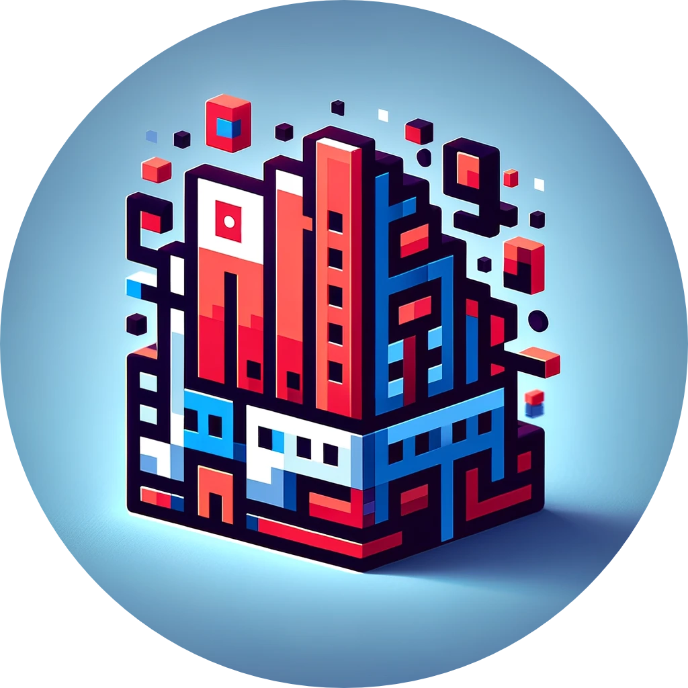

  

<h1 align="center">
<bold>BlockSage</bold> - Unleashing Creativity in the World of Minecraft
</h1>

Welcome to BlockSage: an innovative AI assistant designed for the vibrant world of Minecraft! 

Building your dream worlds in Minecraft block by block can be a slow and meticulour process. Many builders are needed to complete a project, and even then, it can take months to complete. BlockSage is here to help! 

We are on a mission to transform the way you build in Minecraft, making it faster, more efficient, and a whole lot more fun. Imagine being able to create complex structures and intricate designs with just a few clicks, all thanks to the power of AI.

In its current development phase, BlockSage is focusing on generating simple, Minecraft-native builds. This is just the first step towards our larger goal. We envision BlockSage as an intelligent partner that adapts to your building style, offering suggestions and ideas to enhance your creations. Whether you're a solo player or part of a building team, BlockSage is designed to streamline your workflow and spark your creativity.

Future updates will include features like suggesting improvements to existing structures, helping to complete unfinished projects, and providing creative solutions to common building challenges. Our aim is to give you the tools to build at a broader scale, simplifying the process while also allowing for more creativity and personal expression.

Stay tuned as we continue to develop BlockSage. We're excited to bring this new level of creativity and efficiency to your Minecraft experience. Building big doesn't have to be a big hassle anymore. With BlockSage, the future of Minecraft building is looking brighter and more imaginative than ever! 🌍✨

